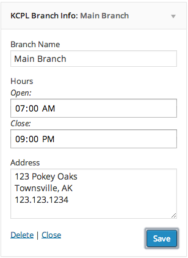
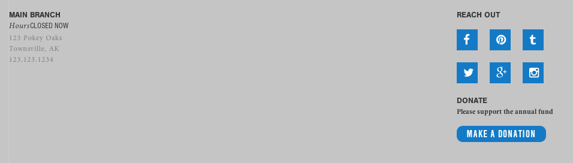
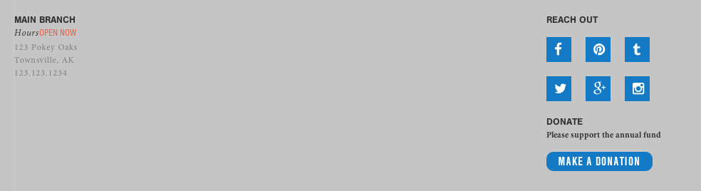

# Kanawha County Public Schools - WordPress

___

## CSS Rules
Markup is documented in /assets/sass/\_elements.sass namespaced with `KCPL_` using SASS variable `#{$namespace}`. Hence, `.#{$namespace}background-red` will output `KCPL_background-red`.

### color
#### brand
Blue: `$blue`

Green: `$green`

Red: `$red`

Yellow: `$yellow`

Grey: `$grey`

#### light brand
Light Blue: `$l-blue`

Light Green: `$l-green`

Light Red: `$l-red`

Light Yellow: `$l-yellow`

Light Grey: `$l-grey`

#### greyscale
Dark Grey: `$d-grey`

Medium Grey: `m-grey`

Light Grtey: `s-grey`

### backgrounds
Blue: `.KCPL_background-blue`

Green: `.KCPL_background-green`

Red: `.KCPL_background-red`

Yellow: `.KCPL_background-yellow`

Grey: `.KCPL_background-grey`

### fonts (font-family, font declaration)
Minion Pro: `$minion` , `.KCPL_font-minion`

Nimbus Sans: `$nimbus`, `.KCPL_font-nimbus`

Nimbus Sans Condensed: `$nimbus-c`, `.KCPL_font-nimbus-condensed`

### sprites
Book: `.KCPL_sprite-book`

Headphones: `.KCPL_sprite-headphones`

Document: `.KCPL_sprite-document`

Periodical: `.KCPL_sprite-periodical`

Video: `.KCPL_sprite-video`

Tablet: `.KCPL_sprite-tablet`

Audiobook: `.KCPL_sprite-audiobook`

Download: `.KCPL_sprite-download`

Kids: `.KCPL_sprite-kids`

Teens: `.KCPL_sprite-teens`

Adults: `.KCPL_sprite-adult`

Facebook: `.KCPL_sprite-facebook`

Pinterest: `.KCPL_sprite-pinterest`

Tumblr: `.KCPL_sprite-tumblr`

Instagram: `.KCPL_sprite-instagram`

Twitter: `.KCPL_sprite-twitter`

Google Plus: `.KCPL_sprite-googleplus`

Mail: `.KCPL_sprite-mail`

Search: `.KCPL_sprite-search`

Mute: `.KCPL_sprite-mute`

Calendar: `.KCPL_sprite-calendar`

Learn: `.KCPL_sprite-learn`

Thumbs Up: `.KCPL_sprite-thumbsup`

Thumbs Down: `.KCPL_sprite-thumbsdown`

Plus: `.KCPL_sprite-plus`

Minus: `.KCPL_sprite-minus`

Create: `.KCPL_sprite-create`

___

## Included Functions

### KCPL_get_menu_parent_ID()
Returns the parent-most ID of the current page based on the Main Nav WordPress menu, rather than the WordPress page hierarchy.

### KCPL_get_sidebar()
When combined with `KCPL_get_menu_parent_ID()`, this function will return the *sidebar_fields* field to use in the left sidebar.

___

## Included Widgets

### Branch Information
This widget is used in the footer and lets users add the branch title, branch hours, and branch location. Hours are calculated based on WordPress' timezone to determine whether the branch is currently open or closed and will render that on the front-end.

Widget: 

Rendered - Closed (after 9pm, but before 7am): 

Rendered - Open (before 9pm, but after 7am) : 
